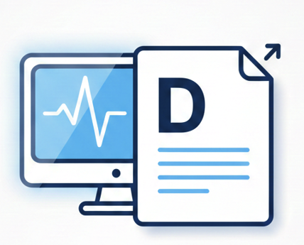

<p align="center">
  
</p>

# DICOM Report Generator


Modern SvelteKit app for designing visual medical reports. Annotate DICOM images via drag-and-drop and export professional PDFs.

## Features

**Visual Design** - Intuitive Konva.js board for shapes, text, and DICOM tag placement  
**Medical Ready** - Native DICOM processing and customizable report templates  
**Modern Stack** - Built with SvelteKit, Tailwind v4, and fully typed with TypeScript  
**Fast Export** - Direct-to-PDF generation using jsPDF

## Quick Start

```
npm install    # Install dependencies
npm run dev    # Start development server

```
